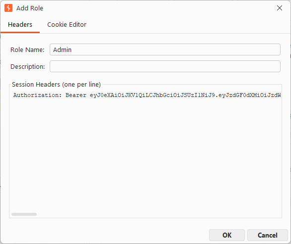
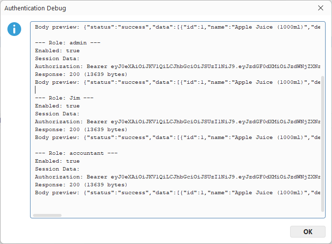
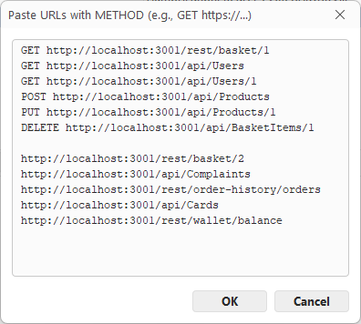
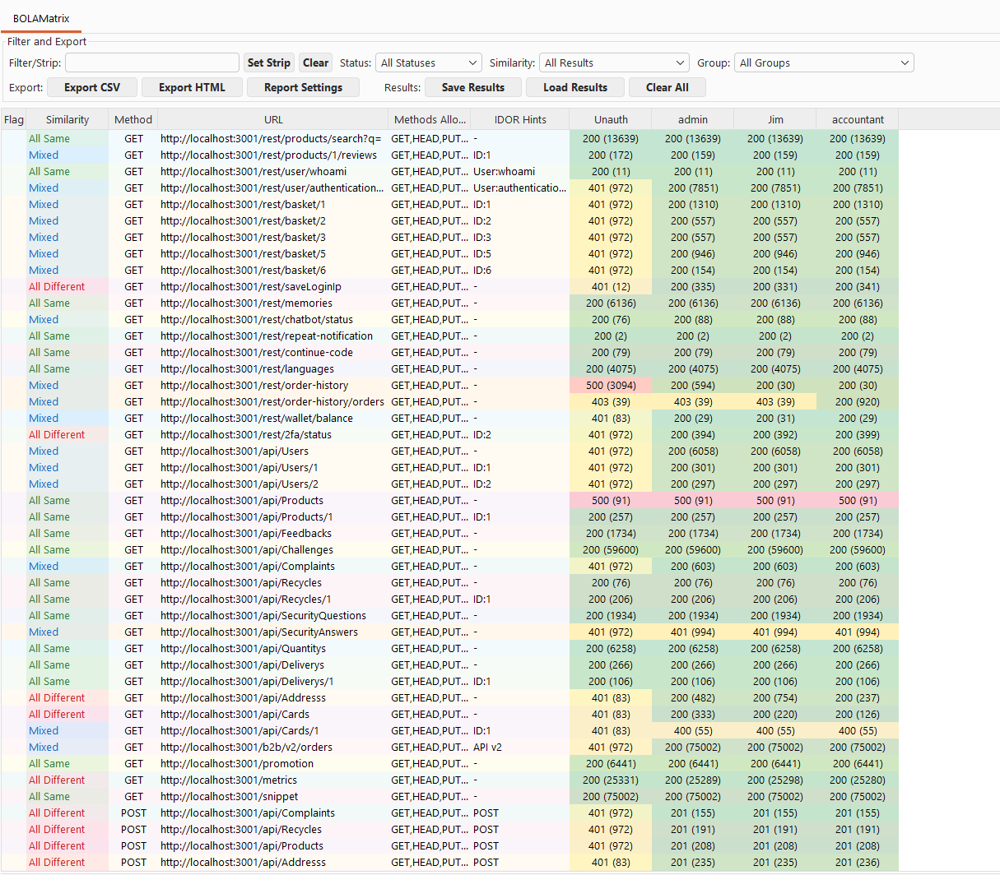
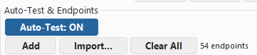
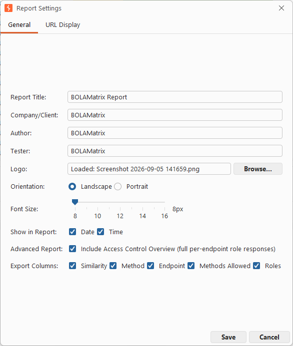
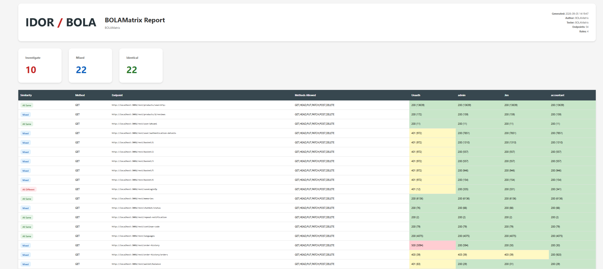

<div align="center">


# BOLAMatrix

**Authorisation Matrix Testing with IDOR Detection for Burp Suite**

_(Inspired by [Autorize](https://github.com/Quitten/Autorize))_


</div>

BOLAMatrix tests every role against every endpoint in one scan, turning an
application's whole authorisation surface into a single colour-coded matrix, then
exporting a white-labelled report. It runs entirely inside Burp Suite.

## Highlights

- **Scan Hundreds Of Endpoints Seamlessly**, across every role, instead of testing one request at a time.
- **Test Role-Based Access Control** across an application with multiple roles, in a single click.
- **Visualise Every Response** in a colour-coded matrix showing each role's HTTP status code and response size for every endpoint, so anomalies stand out instantly.
- **Auto-Detect IDOR Candidates** across 14+ patterns (numeric IDs, Base64, UUIDs, hashes) as the scan runs.
- **Import And Export Entire APIs** from an OpenAPI or Swagger spec, Burp's Proxy History, or the Site Map.
- **Turn The Results Into A Client-Ready Report** that captures every request and response, exported as a white-labelled HTML or CSV file.

---

## Why BOLAMatrix

Applications often ship with several roles, and confirming that each role can reach
only what it should, across every endpoint, is slow and error-prone by hand, one
request and one session at a time. BOLAMatrix does the whole grid in a single pass.

It helps on both sides of the work. Penetration testers get complete authorisation
coverage of an application or API endpoints in minutes, with evidence-quality output
for the report. Developers can point it at their own build to catch broken access
control and IDOR issues before they ship.

---

## How It Works, A Full Run

The same six steps work against any target you're authorised to test.

### 1. Add Your Roles

Add one role per identity you want to compare, such as unauthenticated, a regular
user, and an admin. Paste each role's session data, a `Cookie:` or
`Authorization: Bearer …` header.



### 2. Confirm Every Session Is Valid

Authentication Debug replays one request as each role. A **200 for every role**
means all your sessions are live before you scan.



### 3. Load The Endpoints

Paste a list of URLs, with or without HTTP methods, or pull them from Burp's Proxy
History or Site Map, or import an OpenAPI or Swagger spec.



### 4. Run The Scan And Read The Matrix

Every endpoint is requested as every role. **Red** rows differ across all roles,
**blue** are mixed, **green** are identical. A basket returning `401` to a visitor
but the same `200` to every logged-in user is a broken-access-control finding,
spotted at a glance, with the pattern named in the IDOR Hints column.



### 5. Or Test As You Browse

Flip **Auto-Test** on and every in-scope request you make through Burp is
automatically tested against all your roles and dropped into the matrix, with no
manual scan needed.



### 6. Brand And Export The Report

Set your logo, title and tester details in Report Settings, then export. The report
opens with the Investigate, Mixed and Identical summary cards and the full matrix
beneath, white-labelled and ready for a client.





---

## Key Features

| Feature | Description |
|---------|-------------|
| **Authorisation Matrix** | Test every endpoint across every role in one scan |
| **IDOR Detection** | Auto-detects 14+ patterns: numeric IDs, Base64, UUIDs, hex, hashes |
| **Auto-Test** | Tests in-scope proxy traffic against all roles as you browse |
| **Response Diff Viewer** | Structural JSON diff with noise filtering and IDOR heuristics |
| **OpenAPI / Swagger Import** | Import endpoints from a spec, with IDOR candidate detection |
| **Safe Mode** | DELETE, PUT and PATCH sent as HEAD so target data is never modified |
| **Professional Reports** | White-labelled HTML and CSV export |
| **Session Profiles** | Save and load roles, endpoints, and full results |

---

## Try It Yourself

Point BOLAMatrix at any target you're authorised to test. A local OWASP Juice Shop
instance is a safe, legal sandbox to learn on.

```bash
# Start a target you're authorised to test (for example a local OWASP Juice Shop)
docker run -d -p 3000:3000 bkimminich/juice-shop
```

1. Download [`BOLAMatrix-1.0.0.jar`](BOLAMatrix-1.0.0.jar).
2. In Burp Suite: **Extensions → Add → Java**, then select the jar.
3. Follow steps 1 to 6 above: add roles, load endpoints, Run Scan, export.

Session-token formats are in the [cookie reference](docs/COOKIE_FORMAT.md).
Requires Burp Suite (Community or Professional) and Java 8 or higher.

---

## Bugs and Feature Requests

Please open a GitHub issue on this repository.

## Disclaimer

This tool is for **authorised security testing only**. Always obtain proper
authorisation before testing any system. The demonstration shown here was performed
against OWASP Juice Shop, an intentionally vulnerable application published by OWASP
for security training.

## Author

Built by Kumail Hussain ([LinkedIn](https://www.linkedin.com/in/kumailh/)).

## License

MIT. Copyright (c) 2026 Kumail Hussain. See [LICENSE](LICENSE). Use is subject to
the [Authorised Use Notice](NOTICE).
